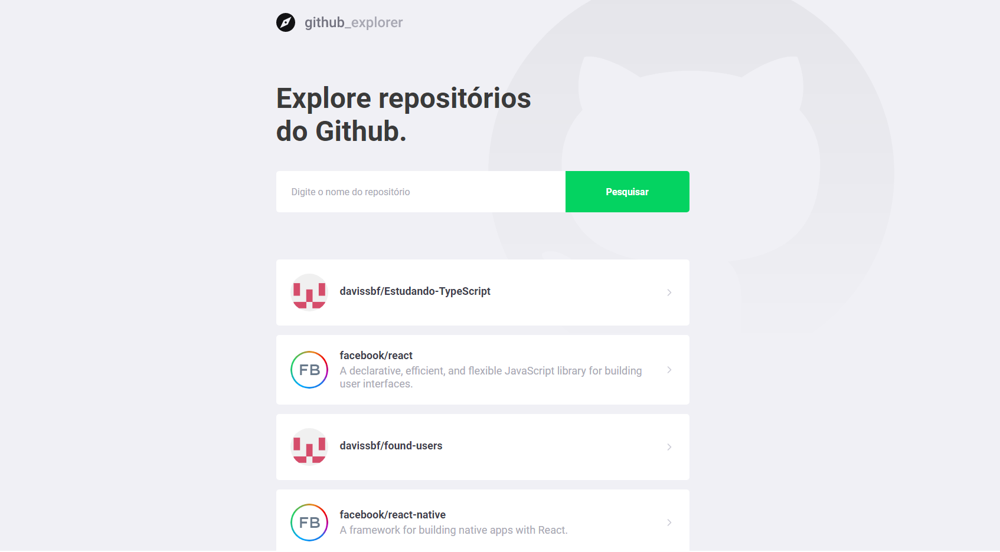
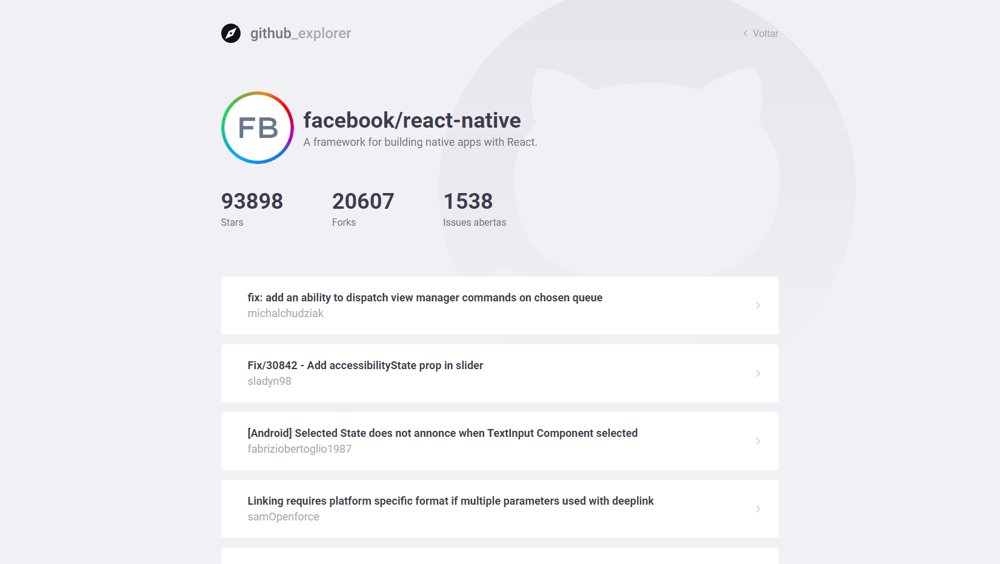
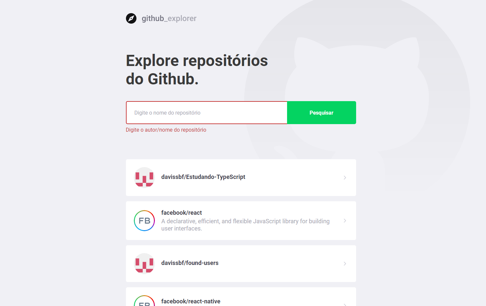

<h1 align=center>
   Git-Repo
</h1>

 

  

## :camera: technologies
### : How to use this App, it's very simple!!

> 1 - Put in the search field the name of user / the name of repository:

- -> Like this: davissbf/estudando-typescript

> 2 - And click in button search

****
 

## : Mistakes that can happen

> 1 - Search without typing the name

> 2 - And typing the wrong name

****
 

## ⚡: Technology

This project was developed with the following Technology:

✔️React

✔️React-router-dom

✔️Typescript

✔️LocalStorage

✔️Styled-components

✔️React-hooks

✔️Axios

✔️Eslint

✔️Prettier

## 💻 Project

Github explorer is an application made using React + typescript, which uses the Github API, to add repositories, see some data such as Issues, forks, stars.

## ⚙ Configuration

1- To install the dependencies:
> yarn

2- To start application:
> yarn start

---
